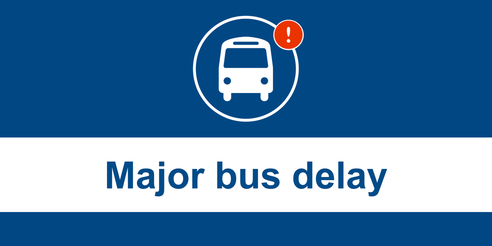
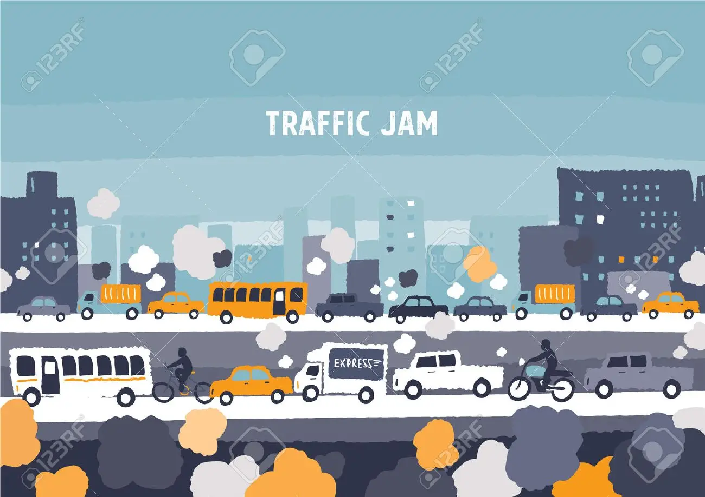

## Motivation 

The cookies anecdote is fun but the school bus delay is a serious issue. The council of the city of New York states that every year starts with a higher rate of delays caused by major traffic because the department of education has not equipped bus companies or drivers with information early enough for drivers to familiarize themselves with their route and map out their timing. Also, it is unconscionable that year after year, the Department of Education's insufficient planning is exacerbating the stress felt by families starting a new school year. We were interested in exploring factors that cause school bus delay and understand the major reason behind bus delay. Distribution of bus delay is also what we want to figure out. 


```{r,echo=FALSE, out.width="50%", fig.cap="NYC BUS DELAY", fig.align = 'center'}
 
```

## Related Work
According to an analysis by [Chalkbeat in partnership with the CITY](https://ny.chalkbeat.org/2021/9/13/22672760/school-buses-leave-nyc-students-stranded-on-first-day), busing complaints have grown in recent years. In 2019, there were an average of 500 delays a day during the first weeks of school, which was up 5% from a year before.We realized that school bus delay is a serious issue after reading their work.

```{r,echo=FALSE, out.width="50%", fig.cap="SCHOOL BUS DELAY", fig.align = 'center'}
 
```

## Data

In this project, there are three primary datasets, including `school bus breakdown and delay`, `weather data`, and `opt code`. The dataset of school bus breakdown and delay was obtained from [NYC open data](https://data.cityofnewyork.us/Transportation/Bus-Breakdown-and-Delays/ez4e-fazm). The weather data was gained from [NOAA](https://www.ncei.noaa.gov/metadata/geoportal/rest/metadata/item/gov.noaa.ncdc:C00861/html). The opt code was collected from [data.world](https://data.world/city-of-ny/8wau-idzf/workspace/file?filename=prek-vendors-by-transportation-site-1.csv). On the one hand, for the dataset of school bus breakdown and delay, to focus on the situation of school bus delay in Manhattan under the pandemic, the data of school bus delays in Manhattan generated during 2020-2021 need to be included.  On the other hand, it is unavoidable to consider the complexity of the computer processing power in this circumstance. Then, the school bus delay data from January 1, 2018 to September 30, 2021 were selected. Since weather is one of the reasons which causes school bus delays, we combine the daily weather dataset from NOAA with school bus delay dataset. Since we can only know the opt code of schools in dataset of school bus delay, we combine a opt code dataset to gather the information about the names and addresses of schools. 

##### School bus breakdown and delay:
The dataset contains all the school bus breakdowns and delays happened in NYC. Each row represents a unique school bus breakdown or delay. The information about how long the school bus delays took, when the event happened, why the event happened, where the event happened, the number of students on the bus, school served, and the bus number can be found in the database. The key variables we used include:

`School_Year`: the academic years including `2018-2019`, `2019-2020`, `2020-2021`.

`Reason`: the reason caused the school bus breakdown or delay. 

`Schools_Serviced`: the school that the corresponding bus served.

`Ocurred_On`: The accurate time that school bus delay or breakdown happened. 

`Boro`: the boro where the case happened.

`How_Long_Delayed`: how long the delay was.

##### Weather data (NOAA):
Weather is one of the reasons which caused the school bus delay. To have a deeper analysis about this, it is necessary to consider the weather of the day. Since the difference of weather in Manhattan is not large, we used the weather data of Central Park in NYC to represent the weather of Manhattan. Thus, we selected several important variables in the weather dataset to joint. The key variables we used:

`prcp`: precipitation (tenths of mm)

`snow`: snowfall (mm)

`snwd`: snow depth (mm)

`tmax`: maximum temperature (tenths of degrees C)

`tmin`: Minimum temperature (tenth of degrees C)

##### OPT code:
In school bus breakdown and delay data frame, we can see the school serviced variable, but it actually just provides the OPT code instead of the concrete names and addresses. Thus, we collected OPT code list of NYC from Data World. The key variable we used:

`OPT_Code`: OPT code.

`Name`: School names.

`Longitude`: Longitude on the map.

`Latitude`: Latitude on the map.

To further figure out whether there is any specific distribution or relationship, we converted the date and added the variables month and weekday in the process of cleaning data.

`Month`: months (January to December)

`Weekday`: weekdays (Monday to Sunday)


```{r,echo=FALSE, out.width="50%", fig.cap="TRAFFIC JAM", fig.align = 'center'}
 
```

## Mapping 

We considered the geolocation of schools in New York city from 2015 to 2019. Compared with other areas, schools in Manhattan have more delays in school buses, and the time of delays are longer. Therefore our project is mainly for schools in Manhattan. Data in these geolocation and density heatmap plots helped identify certain neighborhoods in Manhattan that appear to have more and longer delays  and they include East Harlem and Lower East Side, as well as the Hudson Yards.

## Delay Trend of School Bus

The trend part serves to provide an overview of school bus delays in Manhattan from the Fall of 2018 to the present. As the result of the spread of Covid-19, it is unavoidable to contain the influence of Covid-19 in the analysis. Due to the fluctuating pandemic caused by Covid-19, the difference between the data before the outbreak of Covid-19 and the data after the outbreak of Covid-19 can provide us more enlightenment to estimate the trend of school bus delay circumstance in the future several years. In this part, 5 plots are shown. Each academic year starts from September and ends in June. In the general year, school buses are more likely to delay in the fall semester than the spring semesters, especially during December and January. This may be caused by extreme weather in the winter and the heavy traffic during holiday seasons. Due to the Covid-19, the counts of school bus delays decrease in the current two years. Before the pandemic (2018-2020), we can see that the school buses are more likely to delay in the fall semester than the spring semesters, especially during December and January. From the beginning of fall 2021, schools have switched back to in-person mode with the effort of vaccine enforcement and all other precautions taken, the school bus delay has a similar distribution as the pre-pandemic distribution. If we look closer at the counts of school bus delays each month. In the second plot, a comparison of the school years over 2018 to 2021 is conducted. There is a similar trend for school bus delay distribution from January to December and school bus delay is more frequent in the winter from November to the February in next year.

The types of school bus delays are divided into 5 categories including `0-15 Min`, `16-30 Min`, `31-45 Min`, `46-60 Min`, and `61-90 Min`. In the plot of the distribution of school bus delay time in Manhattan, we conclude that `31-45 Min` and `46-60 Min` are the two most frequent. And `16-30 Min` always took the third place no matter before the pandemic or after the pandemic. Thus, if you meet a school bus delay, you could expect the delay will probably take 15 to 60 minutes. After the outbreak of Covid-19, even though the frequency of school bus delay has decreased drastically, the annual proportion of 46-60-min delay increases, which is an interesting trend. 

We were also curious about whether there existed a monthly rule or a specific trend for each type of school bus delay. According to the plot of monthly distribution of the five different types of school bus delays, 31-45-minute school bus delays and 46-60-minute school bus delays make up the majority part of the total number of school bus delays. For all kinds of school bus delays in the three academic years, the number of delays increases from September to October for all the three academic years. Then, after October, the number of school bus delays decreased first and then kept fluctuating for all types of school bus delays.  All kinds of school bus delays will reach the second peak in either January or February. The 0-15-minute delay, 16-30-minute delay, and 31-45-minute delay are more frequent than usual in May. 31-45-minute delay and 46-60-minute delay are more frequent than usual in March. Thus, October, January, February, March, and May are more probable to encounter school bus delays than else months in a year. 

Furthermore, is there any rule of specific trend related to bus delay in each week? Which weekday will be more probable to encounter a bus delay? Is that possible for students to estimate how long school bus delay will be basically based on weekdays? And generally, how long will the delay be? According to the plot of the weekly distribution of the five different types of school bus delay, there isn’t any specific trend about that. Encountering a school bus delay is almost equivalently probable in each school day. There isn’t a significant fluctuating trend with each academic year. In 2018-2019 academic year and 2019-2020 academic year, the three most frequent types of school bus delays are 31-45 minutes, 46-60 minutes, and 16-30 minutes in turn.  In 2020-2021 academic year, the three most frequent types of school bus delays are 46-60 minutes, 31-45 minutes, and 16-30 minutes in turn. 

## Contributing Factors 


The goal of the contributing factor analyses is to understand the major reasons that lead to the bus delay in Manhattan across three consecutive school years (2018-2019,2019-2020, and 2020-2021). We hypothesized that the heavy traffic and weather conditions may result in the most delay. We first compared the top contributing factors of bus delay in each year. From the bar graph, it is not difficult to find that heavy traffic is the most important reason resulting in bus delay and it is considered as the common factor with high frequency. The top three reasons for bus delay are heavy traffic, a mechanical problem and others. In the stacked bar graph, it is interesting to see that the number of delays per year is decreasing. We suspect that the potential reason for the reduction in delays is due to the COVID-19 and the quarantine policy associated with COVID. Because the difference of frequency between factors is quite large, we decide to show the proportion of each reason based on total delay within three years. Based on the pie chart, we notice that roughly 90% of bus delay is due to heavy traffic and 5.35 % of delay is due to a mechanical problem, and approximately 4% of delay is due to others. This result is roughly the same across three years.

Furthermore, we want to examine the possible relationship between heavy traffic and rainfall as well as between heavy traffic and snow depth. We combine our data with the NOAA dataset from the P8105 website and extract the precipitation and snow depth value from the dataset. We exclude the cases when there is no snow depth and rainfall in the graph we design. According to the scatter plot, more traffic occurred when rainfall is roughly below 100mm, which will be either light rain or moderate rain. We did not see any association between heavy rain and the amount of precipitation. The year 2020-2021 have less rainfall and fewer cases of bus delay compared to other years. We also study the association between heavy traffic and snow depth. Due to the lack of variability of snow depth in 2019-2020, we are unable to do the comparison across years. However, there is a negative association between snow depth and delays because of heavy traffic in 2018-2019; and no association between snow depth and delay is shown in 2020-2021. Since the weather differs from year and year and the data we obtain is not sufficient enough, we can further investigate the issue with a larger dataset.

Finally, we examine the relationship between weekdays and heavy traffic. We calculate the average delay due to heavy traffic per weekday across three years. We observe that heavy traffic happens frequently on Thursday and less frequently on Monday. In the school year 2020-2021, it is almost equally likely to have a similar number of delays on school days. 

## Data Analysis

### Data Explortary

To have some statistical understanding of our data, we decided to take a step further before moving on to modeling.

While looking at the reason of school bus delays, we see that heavy traffic is the main reason and all other reasons plays a minor part. This lead us to ask the question, whether the distribution of school bus delay reasons is the same across 2018-2021 school years.Though we include data in 2021-2022 Fall, yet the counts isn't comparable with other school years. So we only look at the 3 school years including, 2018-2019, 2019-2020, 2020-2021.To answer our question, we conducted a chi-square test. From the test result,we conclude that the reasons of delay have a different distribution across the school years though they seem about the same in our bar plots. Our guess is that although the leading reason remains to be heavy traffic, the percentage of heavy traffic being the reason is actually decreasing over the years.Given that the distribution of delay reasons varies from year to year, we decide to look at the nearest pre-pandemic school year. The reason we focus on 2019-2020 school year is that we assume the post pandemic situation should be similar with the nearest pre pandemic situation. 

Looking at the plot in the distribution of delay reasons,we believe that the frequency of different reasons should not be the same. And now we want to verify our assumption using a chi-square test.From the result, we have enough evidence to say that the frequency of delay reasons are not equally distributed in 2019-2020 school year.

we also noticed that the delay counts varies among each month. We can see from the yearly distribution plot of school bus delays we see that winter time tend to have more delays, thus, we propose hypothesis that there is no homogeneity in delay counts in each months. According to the chi-square test result we conclude that there's no difference of delay counts between months. The counter-intuitive result may be caused by the lock down during April to May of 2020.We don't have any information on these 2 month therefore we are only testing the "winter month".

We know there's no difference of delay counts between months in 2019-2020. But what about different weekdays? I remembered that I was always late for school on Monday. Is it my personal problem? Maybe because of more school bus delays on Monday? To find out the real reason,we use Chi-squared test to see whether there is  homogeneity in delay counts for each weekday. According to the chi-square test result we conclude that there's no statistically difference among weekdays at 0.05 significant level. Unfortunately, there is homogeneity in the delay counts for each weekday. It seems that the reason I was always late on Monday was I still missed my weekend.

### Modeling

From previously data exploration and data analysis, we know that there exists some interesting relationship between bus delay and weather,location, and a variety of reasons.Here, we want to explore the data set deeper to predict the number of daily delay in Manhattan as our outcome and month, weekday, daily precipitation,daily snow depth,and minimum temperature as predictors.We propose 3 models for prediction:

\ 1. Linear Model of daily_delay ~ month + day + snwd + tmin

\ 2. Linear Model of daily_delay ~ month + day  + snwd + tmin+ tmin*day,assuming that there are interaction

\ 3. Linear Model of daily_delay ~ month + day  + prcp

We performed cross validation using these 3 models and model3 gives us a relatively low rmse . So we concluded that, to predict how many school bus delay may occur Manhattan in one day, we would use month,rainfall,snow depth, and weekday as predictors .


#Contributors: Paulina Han, Guiqi Cai, Qixiang Chen, Huili Zheng, and Hanfu Shi

